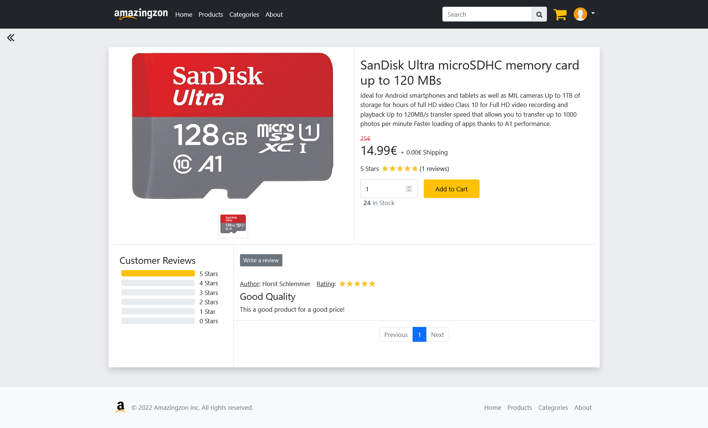

# Amazingzon

*Repository for student project 'Amazingzon', originally developed
in [this](https://github.com/Blo0dR0gue/PreAmazingzon) repository.*

This project is created as part of the 'Web Engineering 2' lecture in summer semester 2022 in the Applied Computer
Science course at DHBW Mannheim.
The aim is the creation of a web-shop, named *Amazingzon*.

  

## Getting Started

The project is designed to be executed in a local xampp installation or via Gitpod.
For setting up the MySQL database there is an `install.sql` file located in the project root.

## Features

Below is the list of agreed features, their implementation state and where to find them if necessary.

- [ ] products
    - [ ] categories
    - [x] price inclusive shipping cost
    - [x] description
    - [x] quantity / stock
    - [x] multiple images
    - [ ] search
    - [x] ratings including comments
- [ ] User area
    - [x] register
    - [x] login and logout
    - [x] change personal data e.g. email
    - [x] change password
    - [ ] manage multiple delivery addresses
    - [ ] order overview / history
    - [ ] invoice generation (as pdf)
    - [x] shopping cart
- [ ] admin area
    - [ ] product management
        - [x] show & create products
        - [x] edit product e.g. change price, images, description, quantity
    - [x] user management
        - [x] deactivate or delete users
    - [ ] category management
    - [ ] order management
- [ ] ~~auctions~~

## Technical Details

This project is based on `HTML`, `CSS`, `PHP`, `MySQL` and `Javascript`.

### Libraries and APIs

The following libraries or APIs are used in the project in advance to the above stated technologies:

* [jQuery](https://jquery.com/): for simplifying some JavaScript statements
* [Bootstrap](https://getbootstrap.com/) CSS & JS: for styling and GUI related things
* [Popper](https://popper.js.org/): for better tooltips (recommended by Bootstrap)
* [TCPDF](https://github.com/tecnickcom/tcpdf): PHP library for generating PDF documents on-the-fly

### Directory Structure

| Dir           | Description                                               |
|---------------|-----------------------------------------------------------|
| assets        | Other assets, e.g. config files, images, js and css.      |
| controller    | Controller skripts as part of the MVC.                    |
| include       | Scripts and elements included in pages.                   |
| model         | Model skripts as part of the MVC.                         |
| pages         | Sub pages of the website.                                 |
| `index.php`   | Main entry point of the website.                          |
| `install.sql` | File for setting up the MySQL database.                   |
| `README.md`   | Markdown file giving basic information about the project. |

### Database

The `MySQL` database is designed using [MySQL Workbench](https://www.mysql.com/de/products/workbench/), following this
diagram:

### Test Data

The project comes with some test data already inserted into the database by the `install.sql`-script.
Important values for testing are:

**Predefined Users:**

| Role        | Email/Username | Password   |
|-------------|----------------|------------|
| normal user | user@user.de   | sh7up#KT!  |
| admin       | admin@admin.de | sh7up#KT!  |

## Screenshots

 

## Authors

Project developed by [Daniel Czeschner](https://github.com/Blo0dR0gue)
and [Frederik Wolter](https://github.com/FrederikWolter).
