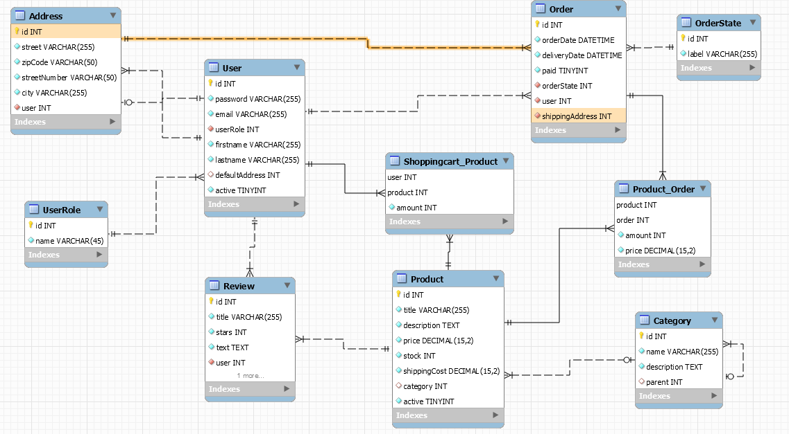

# (Pre-) Amazingzon

Preparation repository for student project "Amazingzon".

This project is created as part of the 'Web Engineering 2' lecture in summer semester 2022 in the Applied Computer
Science course at DHBW Mannheim.
The aim is the creation of a simple web-shop.

## Authors

Project developed by:

* [Daniel Czeschner](https://github.com/Blo0dR0gue)
* [Frederik Wolter](https://github.com/FrederikWolter)

## Getting Started

The project is designed to be executed in a local xampp installation or via GitPot.

## Libraries/APIs

The following libraries or APIs are used in the project:

* [Bootstrap](https://getbootstrap.com/) CSS & (JS): for styling and GUI related things
* [Popper](https://popper.js.org/): for better tooltips (recommended by Bootstrap)

## Technical Details

### Database

Following the design of the database using [MySQL Workbench](https://www.mysql.com/de/products/workbench/):

### Dir-Structure